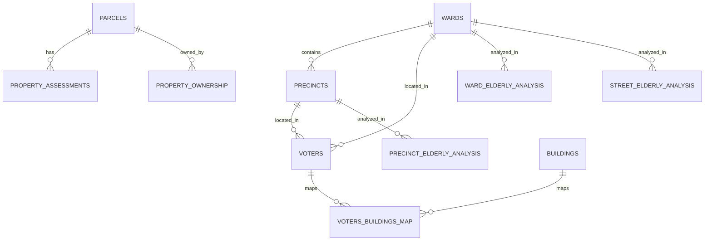

# Allston-Brighton ABCDC Database Schema Documentation

## Overview

This database schema is designed to support the Allston-Brighton Community Development Corporation (ABCDC) Affordable Senior Housing Initiative. It integrates voter demographics, property data, geographic boundaries, and analysis results to enable comprehensive analysis of elderly population needs and housing opportunities.

## Database Design Principles

### 1. **Geographic-First Design**
- All spatial data uses PostGIS with SRID 4326 (WGS84)
- Geographic relationships are maintained through spatial indexes
- Supports complex spatial queries for proximity analysis

### 2. **Temporal Data Management**
- Property assessments track changes over time
- Analysis results are timestamped for historical tracking
- Computed columns automatically calculate age and elderly status

### 3. **Performance Optimization**
- Strategic indexing for common query patterns
- Materialized views for complex aggregations
- Spatial indexes for geographic operations

## Core Tables

### **Geographic Boundaries**

#### `wards`
- **Purpose**: Political ward boundaries (Ward 21 & 22)
- **Key Fields**: `ward_id`, `ward_name`, `geometry`
- **Relationships**: One-to-many with `precincts`, `voters`

#### `precincts`
- **Purpose**: Voting precinct boundaries within wards
- **Key Fields**: `precinct_id`, `ward_id`, `precinct_name`, `geometry`
- **Relationships**: Many-to-one with `wards`, one-to-many with `voters`

#### `census_tracts`
- **Purpose**: Census tract boundaries with income data
- **Key Fields**: `tract_id`, `median_income`, `geometry`
- **Use Case**: Income analysis and demographic correlation

### **Property Data**

#### `parcels`
- **Purpose**: Property parcel boundaries and basic information
- **Key Fields**: `parcel_id`, `site_address`, `zoning`, `year_built`, `geometry`
- **Relationships**: One-to-many with `property_assessments`, `property_ownership`

#### `property_assessments`
- **Purpose**: Property valuation data by fiscal year
- **Key Fields**: `parcel_id`, `fiscal_year`, `total_value`, `building_value`, `land_value`
- **Use Case**: Property value trends and affordability analysis

#### `property_ownership`
- **Purpose**: Property ownership information
- **Key Fields**: `parcel_id`, `owner_name`, `owner_address`
- **Use Case**: Identifying potential development partners

### **Resident Data**

#### `voters`
- **Purpose**: Registered voter demographics and locations
- **Key Fields**: `res_id`, `date_of_birth`, `occupation`, `latitude`, `longitude`
- **Computed Fields**: `is_elderly` (age >= 62), `age` (current age)
- **Use Case**: Elderly population analysis and outreach planning

### **Infrastructure**

#### `roads`
- **Purpose**: Major road network
- **Key Fields**: `road_name`, `road_type`, `geometry`
- **Use Case**: Accessibility analysis

#### `parks_openspace`
- **Purpose**: Parks and open space areas
- **Key Fields**: `park_name`, `park_type`, `geometry`
- **Use Case**: Amenity proximity analysis

## Analysis Tables

### **Elderly Population Analysis**

#### `ward_elderly_analysis`
- **Purpose**: Ward-level elderly population statistics
- **Key Fields**: `ward_id`, `elderly_count`, `mean_age`, `median_age`
- **Source**: Aggregated from `voters` table

#### `precinct_elderly_analysis`
- **Purpose**: Precinct-level elderly population statistics
- **Key Fields**: `ward_id`, `precinct_id`, `elderly_count`, `mean_age`
- **Use Case**: Targeted outreach planning

#### `street_elderly_analysis`
- **Purpose**: Street-level elderly population statistics
- **Key Fields**: `street_name`, `ward_id`, `elderly_count`, `mean_age`
- **Use Case**: Neighborhood-specific analysis

## Key Views

### **`elderly_by_ward`**
Comprehensive elderly population statistics by ward including:
- Total elderly count
- Age distribution (62-69, 70-79, 80-89, 90+)
- Mean and median ages
- Min/max ages

### **`property_values_by_ward`**
Property value analysis by ward including:
- Total property count
- Average, median, min, max property values
- High-value property count (>$1M)

### **`elderly_density_by_precinct`**
Elderly population density analysis including:
- Elderly count per precinct
- Density per square kilometer
- Precinct area calculations

## Analysis Functions

### **`elderly_within_buffer(center_lat, center_lon, buffer_meters)`**
- **Purpose**: Find elderly residents within a specified distance of a point
- **Returns**: Resident ID, distance, and age
- **Use Case**: Site selection for senior housing

### **`properties_near_elderly(elderly_threshold, max_distance_meters)`**
- **Purpose**: Find properties near concentrations of elderly residents
- **Parameters**: 
  - `elderly_threshold`: Minimum number of elderly residents nearby
  - `max_distance_meters`: Maximum search radius
- **Use Case**: Identifying optimal locations for senior housing

## Data Relationships



## Common Query Patterns

### **1. Elderly Population by Geographic Area**
```sql
-- Elderly count by ward
SELECT ward_name, elderly_count, mean_age 
FROM elderly_by_ward 
ORDER BY elderly_count DESC;

-- Elderly density by precinct
SELECT precinct_id, elderly_count, elderly_per_sq_km
FROM elderly_density_by_precinct
ORDER BY elderly_per_sq_km DESC;
```

### **2. Property Analysis**
```sql
-- High-value properties in areas with elderly population
SELECT p.site_address, pa.total_value, COUNT(v.res_id) as nearby_elderly
FROM parcels p
JOIN property_assessments pa ON p.parcel_id = pa.parcel_id
JOIN voters v ON ST_DWithin(p.geometry, ST_Point(v.longitude, v.latitude), 500)
WHERE v.is_elderly = true AND pa.total_value > 1000000
GROUP BY p.site_address, pa.total_value;
```

### **3. Site Selection for Senior Housing**
```sql
-- Find properties near elderly residents
SELECT * FROM properties_near_elderly(20, 300);
-- Returns properties with 20+ elderly residents within 300 meters
```

### **4. Demographic Analysis**
```sql
-- Age distribution of elderly population
SELECT 
    CASE 
        WHEN age BETWEEN 62 AND 69 THEN '62-69'
        WHEN age BETWEEN 70 AND 79 THEN '70-79'
        WHEN age BETWEEN 80 AND 89 THEN '80-89'
        WHEN age >= 90 THEN '90+'
    END as age_group,
    COUNT(*) as count
FROM voters 
WHERE is_elderly = true
GROUP BY age_group
ORDER BY age_group;
```

## Performance Considerations

### **Indexes**
- **Spatial Indexes**: GIST indexes on all geometry columns
- **Query Indexes**: B-tree indexes on frequently queried columns
- **Partial Indexes**: Elderly-only index for faster elderly population queries

### **Query Optimization**
- Use spatial indexes for proximity queries
- Leverage computed columns for age calculations
- Utilize materialized views for complex aggregations

## Data Loading

### **CSV Import Examples**
```sql
-- Load voter data
COPY voters (res_id, last_name, first_name, date_of_birth, occupation, 
             street_number, street_suffix, street_name, apartment, zip_code, 
             ward_id, precinct_id, full_address, normalized_address, 
             latitude, longitude)
FROM '/path/to/voter_list_cleaned.csv'
WITH (FORMAT csv, HEADER true);

-- Load property assessments
COPY property_assessments (parcel_id, fiscal_year, building_value, 
                          land_value, other_value, total_value, 
                          last_sale_date, last_sale_price, use_code)
FROM '/path/to/allston_brighton_assessments.csv'
WITH (FORMAT csv, HEADER true);
```

## Use Cases

### **1. Outreach Planning**
- Identify precincts with highest elderly populations
- Target specific streets for community engagement
- Plan age-appropriate messaging based on demographics

### **2. Site Selection**
- Find properties near elderly residents
- Analyze property values in high-elderly areas
- Consider accessibility to amenities and services

### **3. Housing Development**
- Assess demand by geographic area
- Identify optimal locations for senior housing
- Analyze property acquisition opportunities

### **4. Policy Analysis**
- Track elderly population trends over time
- Analyze property value impacts
- Evaluate geographic distribution of services

## Maintenance

### **Data Updates**
- Voter data: Annual updates from city elections
- Property assessments: Annual updates from assessor's office
- Analysis tables: Refresh after data updates

### **Performance Monitoring**
- Monitor query performance on spatial operations
- Update statistics after bulk data loads
- Consider partitioning for large tables

## Security Considerations

### **Data Privacy**
- Voter data contains PII - implement appropriate access controls
- Consider data anonymization for public-facing queries
- Implement audit logging for data access

### **Access Control**
- Role-based access for different user types
- Separate read/write permissions
- Geographic data access restrictions

## Future Enhancements

### **Potential Additions**
- Transit accessibility data
- Healthcare facility locations
- Crime statistics by area
- Weather and environmental data
- Social services locations

### **Analytics Extensions**
- Machine learning models for demand prediction
- Real-time data integration
- Mobile application support
- Advanced visualization tools

---

*This schema supports the ABCDC's mission to provide affordable senior housing in Allston-Brighton by enabling data-driven decision making for outreach, site selection, and development planning.*

## Address Standardization and Voter→Building Mapping

### Table: `voters_buildings_map`
- Purpose: Street-level linkage between voter records and building structures to support map visualization and spatial analysis.
- Columns:
  - `res_id text not null` — voter record identifier (from `voters`).
  - `struct_id text not null` — building structure identifier (from `buildings`).
  - `base_key text not null` — canonical key used for join, formatted as `<number> <Street Name>`; casing normalized via InitCap.
  - `matched_on text not null default 'num+street'` — match strategy used.
  - `created_at timestamp default now()` — ingestion timestamp.
- Indexes:
  - `idx_vbm_res_id (res_id)`
  - `idx_vbm_struct_id (struct_id)`

### Canonical Matching Key
- Definition: `LOWER(CONCAT(street_number, ' ', INITCAP(street_name)))` for voters; buildings generate keys from both `st_num` and `st_num2` (when present) plus `st_name`.
- Units/apartments are excluded to match at street address level.
- Street suffix normalization uses database-cased `st_name` as provided; further suffix normalization (St/Rd/Ave) is a planned enhancement.

### Matching Logic (Summary)
1. Buildings: derive integer street numbers from `st_num` and `st_num2` and `INITCAP(st_name)`; expand keys for both numbers when they differ.
2. Voters: derive keys from `street_number` and `INITCAP(street_name)`.
3. Join case-insensitively on the canonical base key and write to `voters_buildings_map`.

### Current Status
- Loaded links: 27,769 voter-to-building rows.
- Consumers: interactive map and data views in `fa25-team-a/web_app`.
