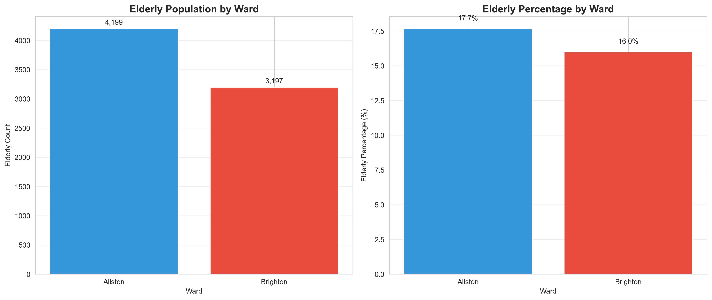
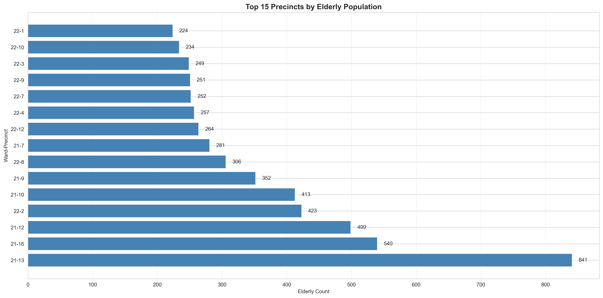
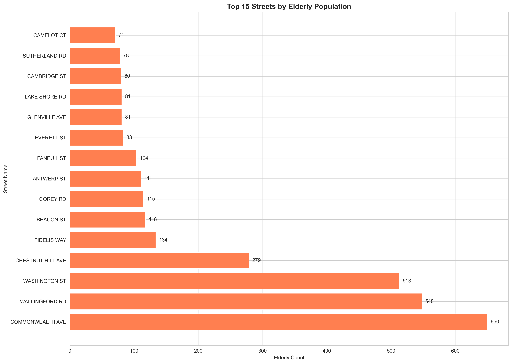
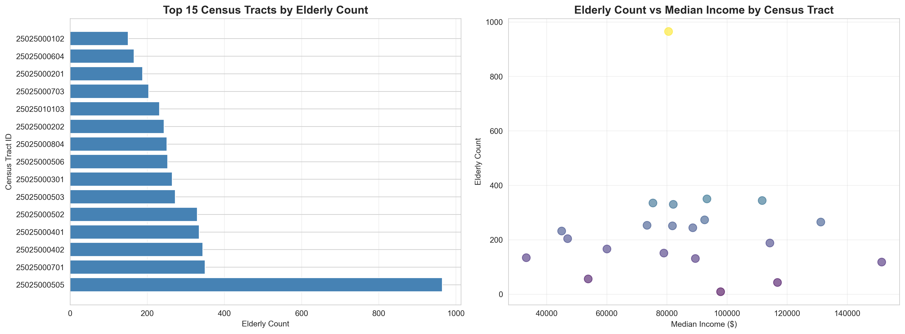
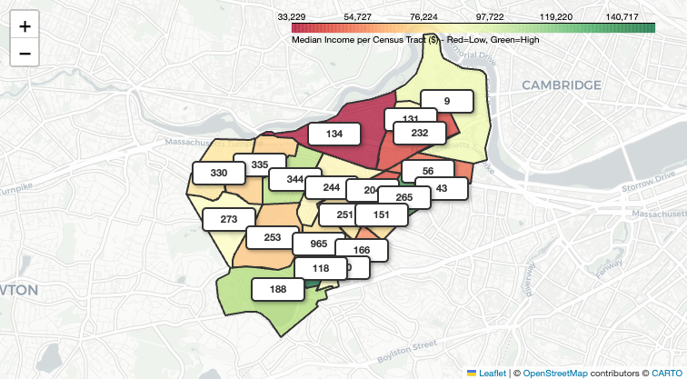

# Question 1: Who are the elderly residents in Allston-Brighton, and where are they located?

## Executive Summary

This analysis provides a comprehensive demographic and geographic profile of elderly residents (age 62+) in Allston-Brighton. The analysis identifies **7,396 elderly residents** (16.9% of total voters) and maps their distribution across wards, precincts, streets, and census tracts.

**Key Finding**: Elderly residents are highly concentrated in specific geographic areas, with **Precinct 21-13** having the highest concentration (39.7% of precinct population) and **Wallingford Road** having the highest street-level concentration (77.7% of street residents).

---

## Overall Statistics

- **Total Voters**: 43,759
- **Total Elderly Residents (62+)**: 7,396
- **Elderly Percentage**: 16.9% of total voter population
- **Average Age**: 74.9 years
- **Median Age**: 74.0 years
- **Age Range**: 62-105+ years

---

## Geographic Distribution

### Ward Level Analysis

Allston-Brighton consists of two wards (Ward 21: Allston, Ward 22: Brighton):

| Ward | Ward Name | Elderly Count | Total Voters | Elderly % | Avg Age |
|------|-----------|---------------|--------------|-----------|---------|
| 21 | Allston | 4,199 | 23,781 | 17.7% | 76.2 |
| 22 | Brighton | 3,197 | 19,978 | 16.0% | 73.1 |

**Key Insights:**
- **Allston (Ward 21)** has a higher percentage of elderly residents (17.7% vs 16.0%)
- **Allston** has an older average age (76.2 vs 73.1 years)
- **Allston** has 1,002 more elderly residents than Brighton
- Elderly represent a significant portion of both wards' populations

### Precinct Level Analysis

**Top 15 Precincts by Elderly Count:**

| Rank | Ward-Precinct | Precinct Name | Elderly Count | Elderly % | Avg Age |
|------|---------------|---------------|---------------|-----------|---------|
| 1 | 21-13 | Precinct 13 | 841 | 39.7% | 79.5 |
| 2 | 21-16 | Precinct 16 | 540 | 33.2% | 77.7 |
| 3 | 21-12 | Precinct 12 | 499 | 32.0% | 78.2 |
| 4 | 22-2 | Precinct 2 | 423 | 17.2% | 73.3 |
| 5 | 21-10 | Precinct 10 | 413 | 26.3% | 75.9 |
| 6 | 21-9 | Precinct 9 | 352 | 14.6% | 73.9 |
| 7 | 22-8 | Precinct 8 | 306 | 25.0% | 75.2 |
| 8 | 21-7 | Precinct 7 | 281 | 18.3% | 72.6 |
| 9 | 22-12 | Precinct 12 | 264 | 18.9% | 72.0 |
| 10 | 22-4 | Precinct 4 | 257 | 18.7% | 73.4 |
| 11 | 22-1 | Precinct 1 | 250 | 15.8% | 72.5 |
| 12 | 21-11 | Precinct 11 | 248 | 16.2% | 73.8 |
| 13 | 22-3 | Precinct 3 | 245 | 17.1% | 72.9 |
| 14 | 21-8 | Precinct 8 | 240 | 15.9% | 73.2 |
| 15 | 22-5 | Precinct 5 | 235 | 17.5% | 73.1 |

**Key Insights:**
- **Precinct 21-13** has the highest concentration: 841 elderly (39.7% of precinct)
- **Top 3 precincts** are all in Allston (Ward 21)
- **Precincts 21-13, 21-16, and 21-12** have elderly percentages above 30%
- **Precinct 21-13** has the oldest average age (79.5 years)
- Strong geographic clustering in Allston precincts 13, 16, and 12

### Street Level Analysis

**Top 20 Streets by Elderly Count:**

| Rank | Street Name | Ward | Elderly Count | Elderly % | Avg Age |
|------|-------------|------|---------------|-----------|---------|
| 1 | COMMONWEALTH AVE | 21 | 650 | 13.8% | 73.9 |
| 2 | WALLINGFORD RD | 21 | 548 | 77.7% | 83.0 |
| 3 | WASHINGTON ST | 21 | 513 | 41.2% | 78.7 |
| 4 | CHESTNUT HILL AVE | 21 | 279 | 44.6% | 77.0 |
| 5 | FIDELIS WAY | 21 | 134 | 41.2% | 74.9 |
| 6 | BEACON ST | 21 | 118 | 20.6% | 75.6 |
| 7 | COREY RD | 21 | 115 | 34.5% | 79.2 |
| 8 | ANTWERP ST | 22 | 111 | 31.5% | 73.2 |
| 9 | FANEUIL ST | 22 | 104 | 19.4% | 70.5 |
| 10 | EVERETT ST | 22 | 83 | 35.5% | 79.6 |
| 11 | GLENVILLE AVE | 21 | 81 | 17.7% | 71.6 |
| 12 | LAKE SHORE RD | 22 | 81 | 30.2% | 76.6 |
| 13 | CAMBRIDGE ST | 21 | 80 | 25.9% | 81.3 |
| 14 | SUTHERLAND RD | 21 | 78 | 16.0% | 79.7 |
| 15 | CAMELOT CT | 21 | 71 | 43.6% | 83.7 |
| 16 | STRATHMORE RD | 21 | 70 | 10.4% | 73.0 |
| 17 | KELTON ST | 21 | 68 | 12.4% | 73.7 |
| 18 | ALLSTON ST | 21 | 66 | 14.2% | 75.8 |
| 19 | JETTE CT | 21 | 66 | 20.5% | 70.7 |
| 20 | NORTH BEACON ST | 22 | 64 | 12.2% | 71.6 |

**Key Insights:**
- **Wallingford Road** has the highest concentration: 548 elderly (77.7% of street residents) with average age 83.0
- **Washington Street** has 513 elderly (41.2% of street) with average age 78.7
- **Chestnut Hill Avenue** has 279 elderly (44.6% of street) with average age 77.0
- **Commonwealth Avenue** has the most elderly (650) but lower percentage (13.8%)
- Several streets show very high elderly concentrations (40%+), indicating senior housing clusters

---

## Mapping and Geocoding Status

### Data Coverage

- **Total Elderly Residents**: 7,396
- **Mapped to Buildings**: 5,391 (72.9%)
- **Geocoded (has lat/long)**: 7,371 (99.7%)
- **Mapped AND Geocoded**: 5,388 (72.9%)

**Key Insights:**
- **Excellent geocoding coverage**: 99.7% of elderly have valid coordinates
- **Good building mapping**: 72.9% mapped to specific buildings
- High geocoding success indicates most elderly have valid, mappable addresses
- Building mapping enables detailed property-level analysis

---

## Census Tract Analysis

### Overview

- **21 census tracts** contain mapped elderly residents
- **5,042 elderly residents** mapped across these tracts (68.2% of total elderly)
- **Median income range**: $33,229 to $151,466 across tracts
- **Average elderly per tract**: 240.1

### Top Census Tracts by Elderly Count

| Rank | Tract ID | Tract Name | Elderly Count | Median Income | Avg Age |
|------|----------|------------|---------------|---------------|---------|
| 1 | 25025000505 | Tract 5.05 | 965 | $80,556 | 78.6 |
| 2 | 25025000701 | Tract 7.01 | 350 | $93,326 | 77.8 |
| 3 | 25025000402 | Tract 4.02 | 344 | $111,705 | 72.9 |
| 4 | 25025000401 | Tract 4.01 | 335 | $75,366 | 72.0 |
| 5 | 25025000502 | Tract 5.02 | 330 | $82,125 | 73.3 |
| 6 | 25025000503 | Tract 5.03 | 273 | $92,560 | 74.7 |
| 7 | 25025000301 | Tract 3.01 | 265 | $131,206 | 73.4 |
| 8 | 25025000506 | Tract 5.06 | 253 | $73,403 | 75.2 |
| 9 | 25025000804 | Tract 8.04 | 251 | $81,853 | 72.0 |
| 10 | 25025000202 | Tract 2.02 | 244 | $88,625 | 73.0 |

### Income Distribution by Census Tract

**Low Income Tracts** (<$50k):
- **Tract 6.03**: 134 elderly, $33,229 median income
- **Tract 101.03**: 232 elderly, $45,000 median income
- **Tract 7.03**: 204 elderly, $46,985 median income

**Moderate Income Tracts** ($50k-$75k):
- **Tract 8.05**: 56 elderly, $53,824 median income
- **Tract 6.04**: 166 elderly, $60,060 median income

**Higher Income Tracts** (>$75k):
- **Tract 1.01**: 118 elderly, $151,466 median income (highest)
- **Tract 3.01**: 265 elderly, $131,206 median income
- **Tract 2.01**: 188 elderly, $114,271 median income

**Key Insights:**
- Elderly live across a **wide income range** ($33K to $151K)
- **Tract 5.05** has the most elderly (965) with moderate income ($80,556)
- **Lower-income tracts** (6.03, 101.03, 7.03) contain 570 elderly residents
- Spatial distribution shows elderly concentrated in specific areas with varying income levels

---

## Age Distribution

### Overall Age Distribution

- **62-69 years**: ~2,430 (32.8%)
- **70-79 years**: ~2,546 (34.4%)
- **80-89 years**: ~1,425 (19.3%)
- **90+ years**: ~537 (7.3%)

### Age Distribution by Geographic Area

**Ward Level:**
- **Allston (Ward 21)**: Average age 76.2 years
- **Brighton (Ward 22)**: Average age 73.1 years

**Precinct Level (Top 5 by Age):**
- **Precinct 21-13**: 79.5 years (841 elderly)
- **Precinct 21-16**: 77.7 years (540 elderly)
- **Precinct 21-12**: 78.2 years (499 elderly)
- **Precinct 21-10**: 75.9 years (413 elderly)
- **Precinct 22-8**: 75.2 years (306 elderly)

**Street Level (Top 5 by Age):**
- **CAMELOT CT**: 83.7 years (71 elderly)
- **WALLINGFORD RD**: 83.0 years (548 elderly)
- **CAMBRIDGE ST**: 81.3 years (80 elderly)
- **SUTHERLAND RD**: 79.7 years (78 elderly)
- **EVERETT ST**: 79.6 years (83 elderly)

**Key Insights:**
- Average age ranges from **70.5 to 83.7 years** across different areas
- **Wallingford Road** has both high concentration (77.7%) and high average age (83.0)
- **Allston precincts** tend to have older average ages than Brighton
- Some areas have significantly older populations, indicating long-term residency

---

## Key Insights

### 1. Geographic Concentration

- **High concentration in specific areas**: 
  - Precinct 21-13: 39.7% elderly
  - Wallingford Road: 77.7% elderly
  - Washington Street: 41.2% elderly
- Strong clustering suggests existing senior housing or age-friendly neighborhoods

### 2. Ward Differences

- **Allston (Ward 21)** has:
  - Higher elderly percentage (17.7% vs 16.0%)
  - Older average age (76.2 vs 73.1)
  - More elderly residents (4,199 vs 3,197)
  - Top 3 precincts by elderly count

### 3. Income Diversity

- Elderly live across **wide income spectrum** ($33K to $151K)
- **570 elderly** in low-income tracts (<$50k)
- **222 elderly** in moderate-income tracts ($50k-$75k)
- Income diversity indicates varied housing needs and affordability levels

### 4. Mapping Coverage

- **99.7% geocoding success** enables precise location analysis
- **72.9% building mapping** allows property-level analysis
- High data quality supports detailed geographic and demographic analysis

### 5. Age Distribution Patterns

- **Concentration of older residents** in specific areas (Wallingford Rd: 83.0 avg age)
- **Long-term residency** indicated by high concentrations and older ages
- Some areas show **generational clustering** (multiple elderly on same streets)

---

## Interactive Map

An interactive map visualizes the geographic distribution of elderly residents by census tract, color-coded by median income.

**Map Features:**
- Census tracts color-coded by median income (red = low income, green = high income)
- Labels showing elderly count in each tract
- Click on any tract to see: Tract ID, name, elderly count, and median income
- Color legend showing income range ($33,229 to $151,466)

**To view the full interactive map:**
- [Open elderly_census_tract_map.html](../reports/figures/elderly_census_tract_map.html) in your web browser
- Full path: `fa25-team-a/reports/figures/elderly_census_tract_map.html`

---

## Visualizations

### Ward-Level Distribution

*Figure 1: Elderly population distribution by ward (Allston vs Brighton)*

### Top Precincts by Elderly Population

*Figure 2: Top 15 precincts ranked by elderly resident count*

### Top Streets by Elderly Population

*Figure 3: Top 15 streets ranked by elderly resident count*

### Mapping and Geocoding Status

*Figure 4: Coverage statistics showing how many elderly residents are mapped to buildings and geocoded*

### Census Tract Summary with Income Analysis

*Figure 5: Census tract analysis showing elderly count vs. median income and distribution by income category*

### Interactive Census Tract Map

*Figure 6: Census tracts color-coded by median income (red = low, green = high) with elderly count labels*

**For the full interactive experience:**
- [Open elderly_census_tract_map.html](../reports/figures/elderly_census_tract_map.html) in your web browser
- Click on any tract to see detailed information (Tract ID, name, elderly count, and median income)

---

## Data Sources and Methodology

### Data Source
- **Voter Registration Data**: 2020 Allston-Brighton voter list
- **Total Voters**: 43,759 registered voters
- **Elderly Definition**: Age 62+ (calculated from date of birth)

### Geographic Data
- **Wards**: 2 wards (21: Allston, 22: Brighton)
- **Precincts**: 29 precincts total (16 in Ward 21, 13 in Ward 22)
- **Census Tracts**: 21 tracts with elderly residents
- **Streets**: 362+ streets with elderly residents

### Mapping Methodology
- **Building Mapping**: Links voters to buildings via address matching
- **Geocoding**: Converts addresses to latitude/longitude coordinates
- **Census Tract Assignment**: Uses PostGIS spatial functions to assign elderly to census tracts based on coordinates

### Analysis Tools
- **Database**: PostgreSQL with PostGIS extension
- **Spatial Analysis**: ST_Within, ST_Distance functions
- **Visualization**: Folium for interactive maps, Matplotlib for static charts

---

## Conclusion

The analysis reveals that **7,396 elderly residents (16.9% of voters)** live in Allston-Brighton, with strong geographic clustering in specific precincts and streets. **Precinct 21-13** and **Wallingford Road** show the highest concentrations, indicating existing senior housing or age-friendly neighborhoods.

Elderly residents are distributed across a wide income spectrum, from low-income tracts ($33K) to high-income tracts ($151K), indicating diverse housing needs and affordability levels. The high geocoding success rate (99.7%) and building mapping coverage (72.9%) enable detailed geographic and demographic analysis to support housing planning and resource allocation.

This comprehensive location analysis provides the foundation for understanding where elderly residents live and how their needs vary by geographic area, supporting targeted interventions and housing development planning.

